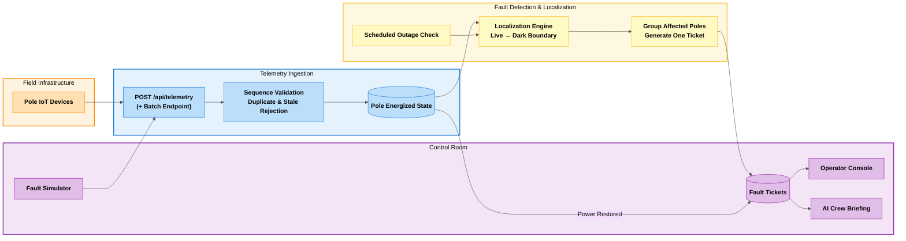

# Architecture

## Diagram

## Data sourcing and ingestion

Devices POST JSON to `/api/telemetry` (or `/api/telemetry/batch`). In production NB-IoT → MQTT would fan into the same handler.

| Concern | Handling |
|---------|----------|
| Duplicates | At-least-once: reject same `device_id`+`seq` |
| Ordering | Trust per-device `seq`; `boot` resets seq |
| Clock skew | Device `ts` stored for audit; localization uses current pole state, not cross-device time equality |
| Stale retries | Reject `power_lost`/`power_restored` older than 6h when newer state exists |
| Bursts | Batch endpoint applies state for all messages, then runs localization once per affected DT |
| Silence | Missing heartbeats while last-known-live → `device_offline`, **not** treated as dark |

## Storage and topology model

SQLite (WAL) with tables: `feeders`, `distribution_transformers`, `poles`, `tickets`, `telemetry_events`, `scheduled_outages`, `simulator_state`.

Network is a **forest of trees** (one per DT). Each pole has `effective_parent_id`:

- **40% of DTs:** copied from recorded `parent_pole_id` / `seq_on_line`
- **60% of DTs:** inferred at seed time with Prim-style MST from DT GPS + pole GPS (`services/topology.py`)

We keep both “registry truth” (nullable parent/seq) and “runtime topology” so the UI can label confidence as `recorded` vs `inferred`.

## Localization algorithm

Re-implementable sketch:

1. For a DT, load poles and build children lists from `effective_parent_id`.
2. **Observably dark** = has device AND `energized=false` AND not (offline with last-known live). Uninstrumented poles are unknown, not dark.
3. **Sensor suspect:** dark pole with any observably live descendant → flag, remove from dark set (impossible as a line fault).
4. If under an active scheduled outage (scope feeder/DT, with −20/+40 min grace) → suppress tickets.
5. If all instrumented poles dark and none live → **DT fault** (later rolled up to **feeder fault** if every DT on the feeder matches).
6. Else find **dark roots** (dark poles whose parent is not dark). Each connected dark component becomes one **span fault** on the edge into the shallowest dark root. Location = midpoint of upstream/downstream coordinates (or DT→first pole). PIN from downstream pole (or first available in component).
7. Upsert ticket by `grouping_key` (`span:dt:up:down` / `dt:id` / `feeder:id`) so dozens of dark poles → **one** open ticket.
8. On each run, if an open ticket’s affected instrumented poles are all live → move to **verified** (auto).

**Complexity:** O(P) per evaluated DT (P = poles under DT). Seed network ~3k poles total.

**60% missing topology:** we always localize to a span using inferred parents, and surface `topology_source=inferred` plus lower confidence. Known failure: parallel laterals close in GPS space can attach to the wrong parent → wrong span by one hop. UI tells the crew to walk the line if the break is not at the pin.

**Simultaneous faults:** separate dark components / DTs → separate grouping keys → separate tickets.

**Confidence:** starts ~0.55; +recorded topology, +clear live upstream, +coverage, +corroborating dark poles; −inferred, −boundary gaps, −single dark pole.

## Noise handling

| Signal | Outcome |
|--------|---------|
| Dead modem (silence, last live) | `device_offline`; no ticket |
| fw 1.2 quiet on outage | Simulator still forces physical dark; localization uses state. In production, pair with heartbeat timeout + neighbor corroboration (documented gap: pure silence without forced state needs neighbor dark votes — we require at least the physical dark state). |
| Isolated dark, live children | Sensor suspect, no ticket |
| Scheduled outage | Suppressed (with grace; cancelled flag respected) |
| Duplicates / out-of-order | Seq gate |

**False-positive story:** we bias toward under-alerting on single-pole and silent-device cases. Residual risk is inferred-topology mis-span and scheduled feed lying (cancelled shutdown) — mitigated by grace windows and confidence labels, not eliminated.

## Ticket workflow

`detected → acknowledged → crew_assigned → resolved → verified → closed`

- **Resolve** checks telemetry; if any affected instrumented pole still dark → HTTP 409, increment `false_resolve_attempts`.
- **Verified** only from measured restoration (or resolve when already live).
- Operator cannot click the system into believing a dark feeder is fixed.

## API surface

| Method | Path | Purpose |
|--------|------|---------|
| GET | `/health` | Liveness |
| GET | `/api/meta` | Seed stats |
| POST | `/api/telemetry` | Single device event |
| POST | `/api/telemetry/batch` | Burst ingest |
| GET | `/api/network/stats` | Counts |
| GET | `/api/network/poles` | Pole states for map |
| GET | `/api/network/dts` | Transformers |
| GET | `/api/network/edges` | Line segments |
| GET | `/api/tickets` | Incident list |
| GET | `/api/tickets/{id}` | Detail |
| POST | `/api/tickets/{id}/actions` | acknowledge/assign/resolve/close |
| POST | `/api/tickets/{id}/briefing` | AI/template briefing |
| GET | `/api/scheduled-outages` | Planned outages mock |
| GET | `/api/simulator/state` | Active sim faults |
| GET | `/api/simulator/suggest-span` | Good demo target |
| POST | `/api/simulator/inject` | span/dt/feeder fault |
| POST | `/api/simulator/repair` | Restore + telemetry |
| POST | `/api/simulator/kill-device` | Dead modem noise |
| POST | `/api/simulator/scheduled-outage-demo` | Load-shed demo |

OpenAPI: `http://localhost:8000/docs`.

## UI reasoning

**First glance:** open incident count, dark pole count, then the incident list (status + asset + PIN + severity). Map is the spatial confirmation, not a dashboard of widgets.

**Shown:** fault asset, coordinates, PIN, confidence + reason, topology source, workflow actions, simulator.

**Deliberately omitted:** crew routing, analytics charts, auth, per-pole alert floods, historical BI. At 2 a.m. those compete with “where do I send the truck.”

**Likely wrong decision:** polling every 4s instead of WebSockets — simpler behind nginx/free hosts; acceptable at this scale.

## AI feature

**Crew briefing** on a ticket: LLM (optional `OPENAI_API_KEY`) turns structured fault facts into a short field brief. Localization remains deterministic graph code.

- **Why here:** operators need language; graphs need certainty.
- **Cost:** ~1 chat completion / briefing when keyed; else free template.
- **Failure:** template fallback always works; cached on ticket.

## Performance (measured locally on seeded DB)

| Metric | Target | Observed (dev machine) |
|--------|--------|-------------------------|
| Inject → ticket in API | &lt; 120s | Typically &lt; 2s (no debounce wait in sim path) |
| Batch ingest 5k | no loss | Supported via `/telemetry/batch` (state apply + one localize) |
| Incident list | &lt; 2s | &lt; 200ms local |
| Repair → verified | &lt; 120s | &lt; 2s |

Re-measure on your host; numbers above are not a substitute for your own `curl` timing in `DEPLOYMENT.md` verification.
